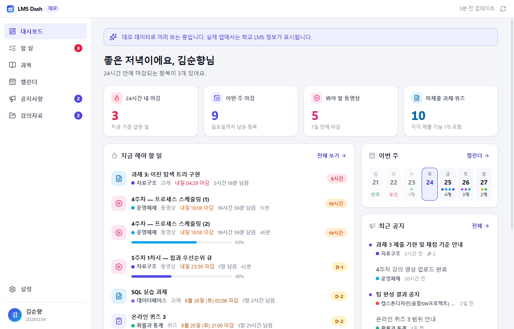
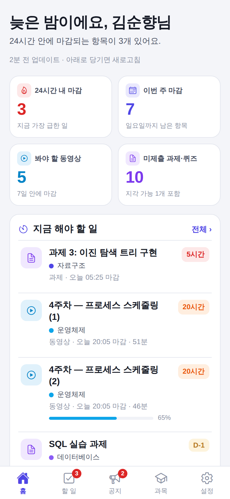
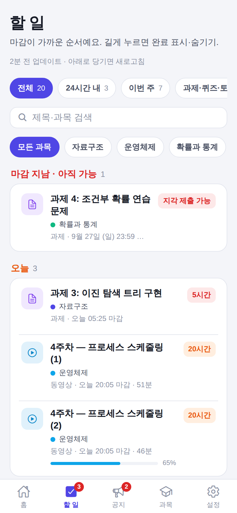
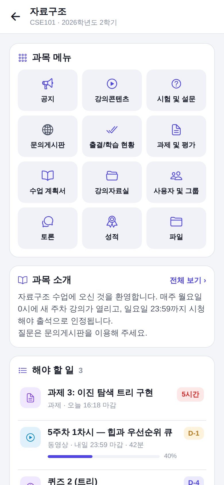
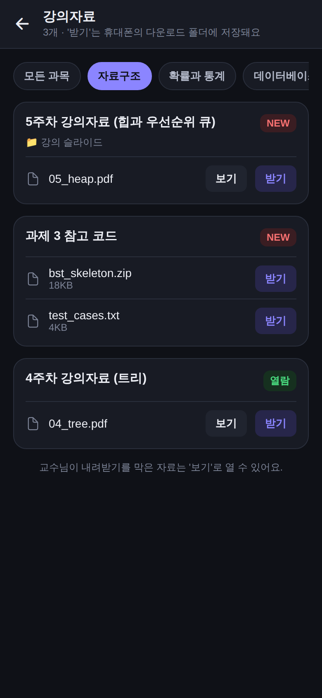
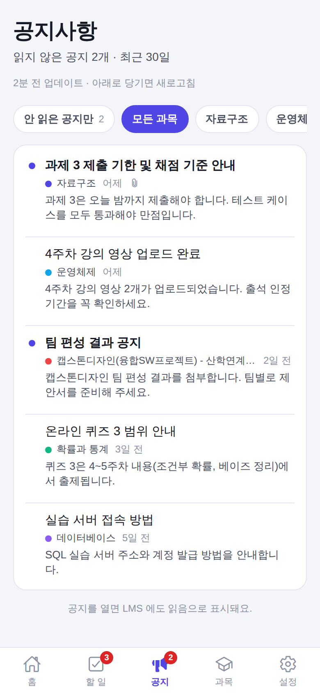

# LMS Dash — 순천향대 e-class 비공식 대시보드

순천향대 e-class(Canvas LMS + LearningX)의 **마감 임박 과제, 봐야 할 강의 동영상, 공지**를 한눈에 보여주는 앱입니다.
**Windows · macOS · Android** 앱과 **iPhone 앱(시험판)** 이 있습니다. LearningX 앱이 불편해서 만든 개인 프로젝트이며, 학교 공식 앱이 아닙니다.

## 다운로드

**[최신 버전 받기 (Releases)](https://github.com/minyj07/LMS-Dash/releases)** — 설치 파일만 있으면 되고, 다른 프로그램은 필요 없습니다.

| 기기 | 파일 | 설명 |
| --- | --- | --- |
| Windows | `LMSDash-Setup-<버전>.exe` | 설치판 (권장). 알림·자동 실행·자동 업데이트가 가장 잘 동작 |
| Windows | `LMSDash-<버전>-portable.exe` | 설치 없이 바로 실행 |
| macOS (Apple 칩) | `LMSDash-<버전>-mac-arm64.dmg` | Apple 메뉴 → 이 Mac에 관하여에 "칩: Apple M…" 이라고 나오는 맥 (2020년 말 이후 대부분) |
| macOS (Intel) | `LMSDash-<버전>-mac-x64.dmg` | "프로세서: Intel …" 이라고 나오는 맥 (Apple 칩 맥에서도 실행은 됨) |
| Android | `LMSDash-<버전>.apk` | `android-v` 로 시작하는 릴리스(모바일)에 있습니다 |
| iPhone (시험판) | `LMSDash-<버전>-iphone-unsigned.ipa` | 모바일 릴리스에 있습니다. 시험판이라 안 되는 기능이 있을 수 있어요. 아래 설치 방법을 보세요 |

- **Windows**: 코드 서명이 없어서 처음 실행할 때 "Windows의 PC 보호" 창이 뜰 수 있습니다 → **추가 정보 → 실행**
- **macOS**: dmg 를 열고 LMS Dash 를 Applications 폴더로 끌어 놓습니다. Apple 개발자 서명이 없어서 처음 열 때 "확인되지 않은 개발자" 경고가 뜹니다.
  - **시스템 설정 → 개인정보 보호 및 보안** 맨 아래의 **"그래도 열기"** 를 누른 뒤 다시 열면 됩니다 (처음 한 번만).
  - 자동 로그인을 켜면 키체인 접근을 묻는 창이 뜰 수 있어요 → **"항상 허용"**
- **Android**: 휴대폰에서 APK 를 받아 열고, "출처를 알 수 없는 앱 설치"를 허용한 뒤 설치합니다.
- **iPhone (시험판)**: 앱 스토어에 올리지 않은 앱이라, PC(Windows·Mac)의 [Sideloadly](https://sideloadly.io) 나 [AltStore](https://altstore.io) 로 설치합니다. Sideloadly·AltStore 는 개발자와 무관한 외부 도구이며, 설치는 본인 Apple ID 와 기기 설정(개발자 모드)에 대한 본인 책임으로 진행해요.
  1. iPhone 을 PC 에 연결하고 Sideloadly 에 IPA 파일과 본인 Apple ID 를 넣어 설치합니다.
  2. iPhone 설정 → 일반 → VPN 및 기기 관리에서 내 Apple ID 를 신뢰하고, (iOS 16 이상) 설정 → 개인정보 보호 및 보안 → **개발자 모드**를 켭니다.
  3. 무료 Apple ID 로 설치한 앱은 **7일마다 다시 설치(서명 갱신)** 해야 합니다. AltStore 는 PC 와 같은 Wi-Fi 에 있으면 자동으로 갱신해 줍니다.
- 설치한 뒤에는 앱이 알아서 업데이트합니다 (Windows·macOS 는 창을 숨겨 두었거나 자리를 비웠을 때, Android 는 앱을 나갈 때 설치). Android 는 앱의 설정 → 업데이트에서 **설치 허용**을 한 번 켜 두면 확인 창 없이 설치됩니다. iPhone 은 설정 → 업데이트에서 새 버전을 확인해 다시 설치합니다.
- 릴리스 페이지의 "Source code" 파일은 GitHub 이 자동으로 붙이는 것으로, 이 안내 문서만 들어 있습니다.

## 주요 기능

- **앱 자체 로그인** (학번·비밀번호, 자동 로그인) — 비밀번호는 기기에만 암호화해 저장
  - 다른 Canvas LMS 학교도 사용 가능 (학교 로그인 페이지에서 직접 로그인)
- **대시보드**: 24시간 내 마감, 이번 주 마감, 봐야 할 동영상, 미제출 과제를 한눈에
- **할 일**: 오늘 / 내일 / 이번 주 / 다음 주로 묶은 목록, 필터와 검색, 지각 제출 가능 항목 표시
- **동영상 출석 현황**: 출석 인정 기간, 진도율, 출석/지각/결석 상태. 아직 열리지 않은 주차는 "○월 ○일 열림"으로 표시
- **과목 메뉴를 앱 화면으로**: 공지·과제·시험·수업 계획서·토론·성적·파일·주차 학습·출결·강의자료실을 LMS 웹 화면 없이 바로
- **공지사항을 앱 안에서 읽기** (LMS 에도 읽음 표시), 첨부파일 받기
- **강의자료 모아보기**와 받기 — 자료 이름 그대로 과목별 폴더에 저장, "모두 받기"
- **마감 알림**: 아직 안 한 항목의 마감 하루 전·3시간 전 (시간 선택 가능)
- **쪽지**: LMS 받은 편지함 읽기·답장, 과목 화면에서 교수님께 바로 쪽지
- **휴대폰 캘린더 연동** (Android·iPhone): 삼성 캘린더·iPhone 캘린더에 마감 일정 넣기
- **자동 업데이트**: 새 버전을 알아서 받아 방해되지 않을 때 설치
- 동영상 시청·과제 제출은 앱 안의 LMS 화면에서 로그인된 상태로 (출석 정상 기록)
- 주간 캘린더, 과목별 화면, 완료 표시·숨기기, 라이트/다크 테마

## 개인정보

개발자 서버는 앱 업데이트 파일과 설치 파일을 내려 주는 일만 하며, 학번·비밀번호·LMS 정보는 받지 않습니다. 이 정보는 **사용자의 기기와 학교 서버 사이에서만** 오갑니다.
앱에는 사용 통계·광고·추적 기능이 없습니다 (서버에는 일반 웹사이트처럼 접속 기록이 남을 수 있고, 홈페이지 방문 통계는 쿠키 없는 Cloudflare Web Analytics 로 봅니다). 자세한 내용은 **[개인정보 처리방침](PRIVACY.md)** 을 보세요.

## 이용 약관

무료로 설치해 쓸 수 있는 비공개 소스 소프트웨어입니다. 수정·재배포·판매는 할 수 없습니다. → **[이용 약관 (라이선스)](LICENSE.md)**

과제 마감·출석 정보가 항상 정확하다는 보장은 없으니, 중요한 일정은 학교 LMS 에서도 꼭 확인하세요.

## 문의

버그 제보, 건의, 개인정보 관련 문의: **[minyj07@sch.ac.kr](mailto:minyj07@sch.ac.kr)**
보안 취약점은 공개 이슈 대신 메일로 알려 주세요 → **[SECURITY.md](SECURITY.md)**
